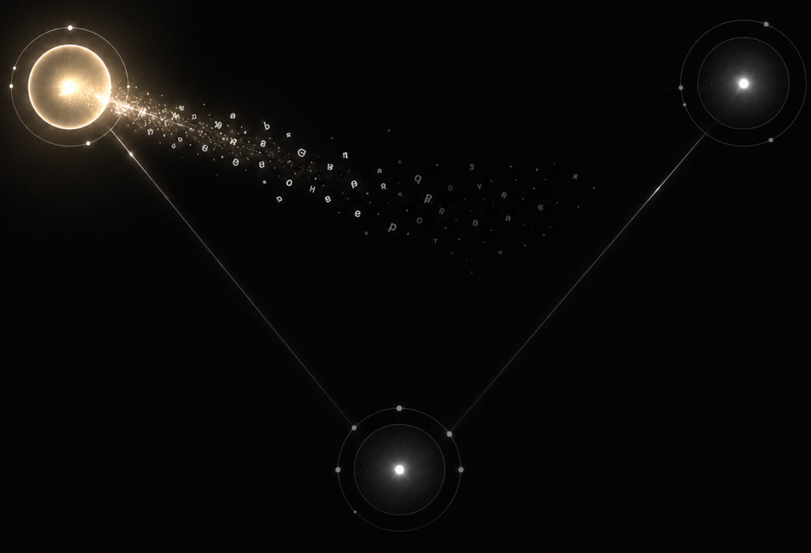
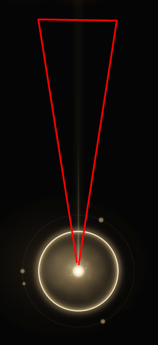
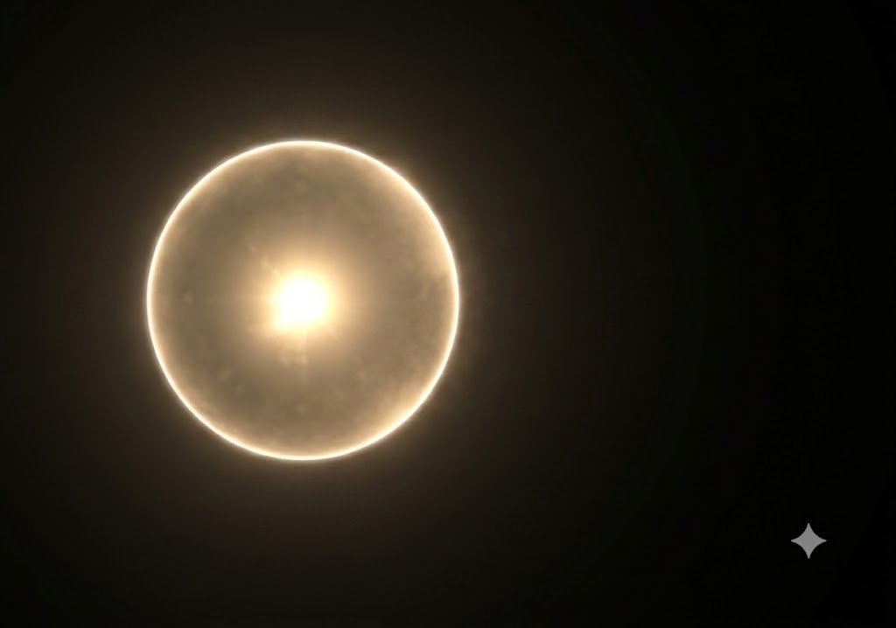
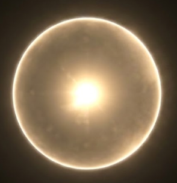
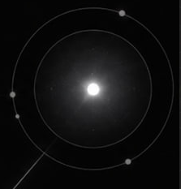
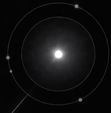
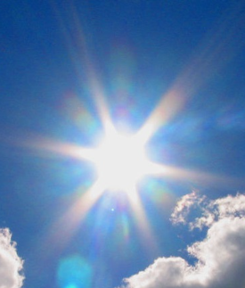
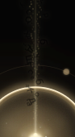

# KODA Sphere References

This folder stores the approved visual references for the KODA onboarding sphere.
Use these images instead of searching through the chat history.

## Core References

| File | Use |
| --- | --- |
|  | Target composition for three spheres, without changing the sphere component itself. |
|  | Letter tail reference: letters should be visible, bright near the comet head, darker in the tail. |
|  | Particle spread reference: particles travel as a narrow throat/cone around the comet path. |
|  | Golden tail mood: thin luminous stream with many small particles. |
|  | Surface glow reference: translucent glass shell, soft cloudy inner texture, hot rim. |
|  | Final phase core reference: white center, yellow edge glow, tiny glints only. |
|  | Description reference for the sphere surface and depth. |
|  | Target for phase 5: bright core, golden cloudy body, glowing rim. |
|  | Target for phase 0: neutral gray/white, centered core, visible outer orbit, minimal gold. |
|  | Large reference for full glass sphere behavior and internal haze. |
|  | Inner orbit activation reference: glow should read inward, not as a thick outside stroke. |
|  | Base standalone sphere reference: two orbits, centered glow, no connecting line. |
|  | Core light direction reference for subtle star-like flare, not oversized rays. |
|  | Reference for a possible orbit-crossing highlight. Currently removed from implementation. |
|  | Bug reference: letters must not render black against the dark scene. |

## Current Lock

The current approved sphere baseline is documented in:

- [KODA_SPHERE_V1_LOCK.md](../../KODA_SPHERE_V1_LOCK.md)

